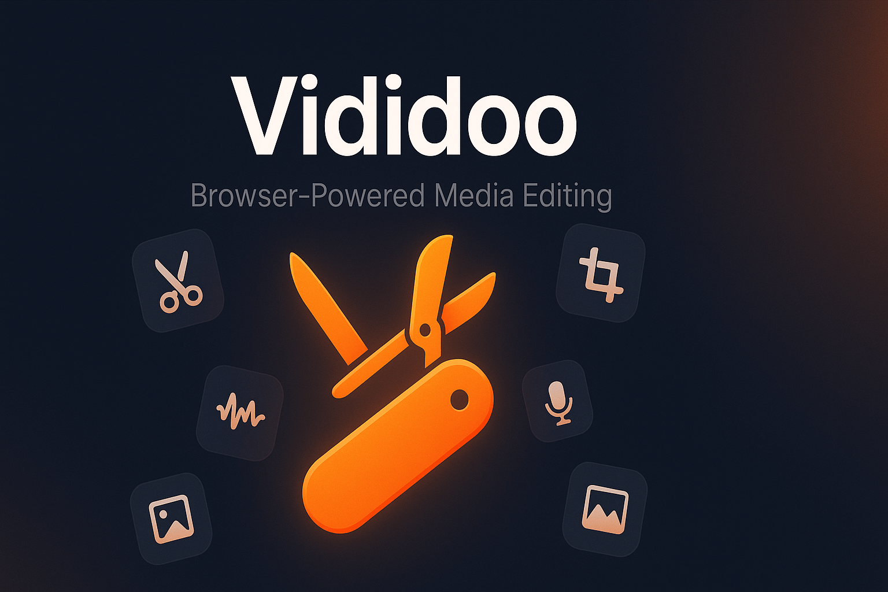

# Vididoo

  

Vididoo is a minimalist media toolbox that gathers the most common editing tasks (cutting, cropping, watermarking, resizing, etc.) and gives each of them a dedicated entry point. The grid-like landing page stays intentionally lightweight so editors can jump straight into the workflow they need without digging through menus.

## Feature highlights
- Cut video — Trim clips to precise in/out points without re-encoding.
- Crop video — Reframe footage to the exact aspect ratio you need.
- Compress video — Shrink file sizes while preserving clarity.
- Resize video — Scale outputs for social feeds, reels, or custom canvases.
- Merge videos — Stitch multiple clips into one continuous timeline.
- Replace audio — Swap the soundtrack while keeping the original visuals.
- Extract audio — Pull standalone WAV/MP3 tracks from any video.
- Blend tracks — Layer multiple audio sources with easy gain controls.
- Add watermark — Overlay logos or text to protect your work.
- Speed control — Ramp footage up or down for slow-mo or time-lapse looks.
- Image to video — Turn still frames into looping video canvases.
- Gray video — Apply grayscale filters for a consistent monochrome style.

## Tech used
- Next.js App Router
- TypeScript
- Tailwind CSS
- shadcn/ui
- Media Bunny
